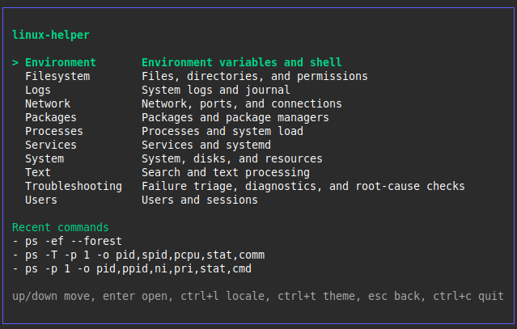
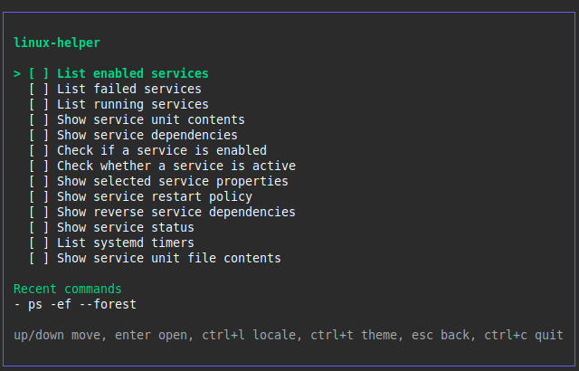
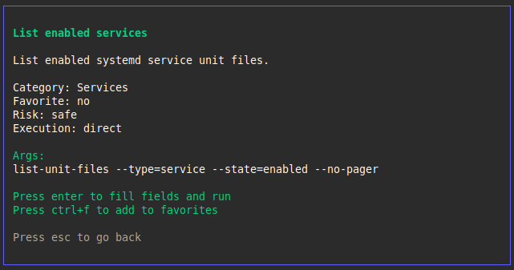
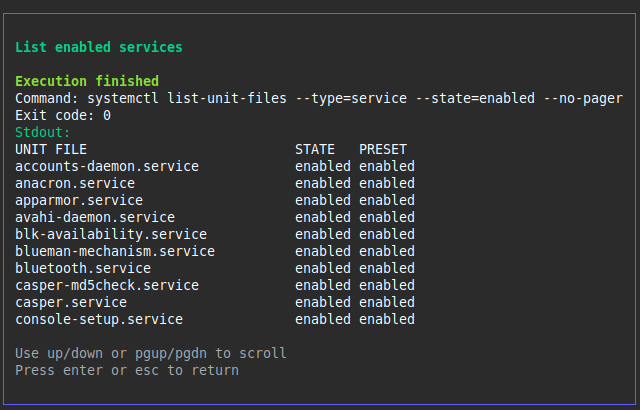

# linux-helper

`linux-helper` is an offline terminal UI for discovering, generating, and executing Linux commands.

Browse 150+ categorized recipes, fill required parameters, preview the final command, and run it locally from a single interface.

Built for Linux administrators, developers, homelab enthusiasts, and anyone tired of memorizing command syntax, flags, and troubleshooting workflows.


## Screenshots

<p align="center">
  
  
</p>
<p align="center">
  
  
</p>

## Current status

The repository currently includes:

- `150` embedded recipes across `11` categories
- embedded recipe loading with optional user overrides
- category-first recipe catalog with browse-only root navigation
- multi-screen Bubble Tea flow: catalog, detail, form, confirmation, result
- direct and shell-based execution modes
- risk confirmation for dangerous commands
- benchmark coverage for startup, embedded loading, registry bootstrap, and catalog discovery
- release hardening for dangerous-confirm, locale/theme refresh, and theme fallback
- embedded locales: `en`, `ua`, `ru`
- storage for config, favorites, recent commands, and logs

## Requirements

- Linux (`x86_64` / `amd64`)
- Go `1.22+`
- `golangci-lint` for linting


## Quick start

Download a release binary or build from source.

Build the binary:

```bash
make build
```

Run the application:

```bash
./bin/linux-helper
```

Run tests:

```bash
make test
```

Run linter:

```bash
make lint
```

Generate coverage report:

```bash
make cover
```

## Development commands

The repository exposes these Make targets:

- `make build` builds `bin/linux-helper`
- `make test` runs `go test ./... -race -count=1`
- `make lint` runs `golangci-lint run`
- `make cover` writes `coverage.out` and opens an HTML coverage report
- `make bench` runs the benchmark suite for startup and catalog discovery paths
- `make clean` removes build and coverage artifacts

## User data paths

The application uses XDG-style paths under the current user's home directory:

- config: `~/.config/linux-helper/config.yaml`
- favorites: `~/.config/linux-helper/favorites.yaml`
- recent commands: `~/.config/linux-helper/recent.yaml`
- recipe overrides: `~/.config/linux-helper/recipes/`
- log file: `~/.local/share/linux-helper/app.log`

If `config.yaml` does not exist, the application falls back to:

- locale: `en`
- theme: `dark`

Example configuration:

```yaml
locale: en
theme: dark
```

## Recipe model

Recipes are YAML files grouped by category under `assets/recipes/`. Each recipe defines:

- metadata such as `id`, `category`, and `risk`
- execution mode: `direct` or `shell`
- command arguments or shell command template
- localized title and description
- input fields used by the TUI form
- examples and tags

At startup, the application loads embedded recipes first and then overlays user-provided recipes from `~/.config/linux-helper/recipes/` when present.

## Project layout

```text
cmd/linux-helper/        application entry point
internal/app/           bootstrap and root Bubble Tea model
internal/tui/           screens, navigation, and theme styling
internal/recipes/       recipe loading, parsing, validation, registry
internal/executor/      command execution and risk handling
internal/services/      orchestration layer used by the TUI
internal/storage/       config, favorites, and recent command persistence
internal/i18n/          locale loading and translation
internal/logger/        file-backed slog logger
internal/models/        domain models
assets/                 embedded recipes, locales, and themes
docs/                   roadmap and changelog
```

## TUI flow

The current application flow is:

1. Browse recipe categories in the catalog.
2. Open the recipe detail screen.
3. Fill recipe fields.
4. Preview the resolved command.
5. Confirm execution for dangerous recipes.
6. Execute and inspect the result screen.

